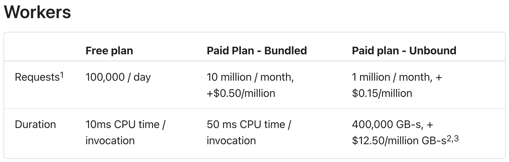
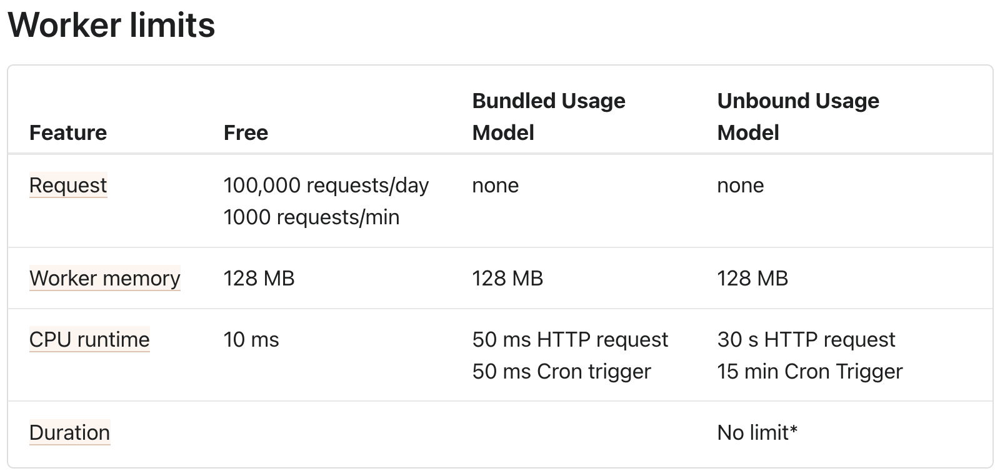
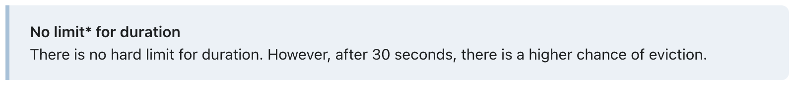

<iframe width="560" height="315" src="https://www.youtube-nocookie.com/embed/TZt-pOc3moc" title="YouTube video player" frameborder="0" allow="accelerometer; autoplay; clipboard-write; encrypted-media; gyroscope; picture-in-picture" allowfullscreen></iframe>

---

disruptive changes

--


--


--


--


--

<!-- .element: data-background-color="white" -->


---

why not AWS?

--

complicated

--

egress charges

--

obvious reasons...

--

<!-- .slide: data-background-image="https://cdn.vox-cdn.com/uploads/chorus_asset/file/22642811/GettyImages_813884326.jpg" -->

 <!-- .element: class="fragment" -->

---

workers <!-- .element: class="r-fit-text" -->

--

_basically..._ <!-- .element: class="small" -->

lambda function

&plus;

api gateway

&plus;

cloudfront

but different <!-- .element: class="fragment r-fit-text" -->

--

not containers

[V8 isolates](https://blog.cloudflare.com/cloud-computing-without-containers/) <!-- .element: class="fragment r-fit-text" -->

--

> V8 is Google’s open source high-performance JavaScript and WebAssembly engine, written in C++. It is used in Chrome and in Node.js, among others.

--

- ✅ javascript!
- ✅ rust! <!-- .element: class="fragment"-->
- ❌ python 😢 <!-- .element: class="fragment"-->
- ❌ binaries <!-- .element: class="fragment "-->

--

no more cold starts

⚡️ 10ms upstart ⚡️ <!-- .element: class="fragment r-fit-text" -->

--

no tuning memory

128MB <!-- .element: class="fragment r-fit-text" data-fragment-index="1" -->

(you get what you get) <!-- .element: class="fragment" data-fragment-index="1" -->

--

no more regions

🌎GLOBAL🌍 <!-- .element: class="fragment r-fit-text" -->

--

no egress charges

pay by execution count <!-- .element: class="fragment r-fit-text" -->

--

no wall time (timeout)

CPU time limit only <!-- .element: class="fragment r-fit-text" -->

--

review

- no egress charges
- pay by execution count
- no wall time
- CPU time limit only

--

_(opinion)_

heavily suited for <!-- .element: class="r-fit-text" -->

IO-bound tasks <!-- .element: class="r-fit-text" -->

--

```ts[|2-13|3-11|5-9|6-8|7|12]
export default {
  fetch(request: Request, env: any, ctx: ExecutionContext): Response {
    const stream = new ReadableStream({
      start(controller) {
        setInterval(() => {
          controller.enqueue(
            new TextEncoder().encode(`${new Date().toISOString()}\n`)
          );
        }, 2500);
      },
    });
    return new Response(stream);
  },
};
```

--

pricing



--

limits




--

- streams
- websockets

--

https://honojs.dev/

```js
import { Hono } from "hono";
const app = new Hono();

app.get("/", (c) => c.text("Hono!!"));

export default app;
```

--

<!-- .slide: data-background-iframe="https://blog.cloudflare.com/doom-multiplayer-workers/" -->

it can run doom <!-- .element: class="highlight-red" -->

---

durable objects

--

> Durable Objects provide low-latency coordination and consistent storage for the Workers platform through two features: global uniqueness and a transactional storage API.

--

```ts
// durable object
export class CounterObject {
  constructor(state, env) {
    this.state = state;
  }

  async fetch(request) {
    let val = await this.storage.get("counter");
    await this.storage.put("counter", val + 1);
    return val;
  }
}
```

```ts
// worker
export default {
  async fetch(request, env) {
    const counterId = new URL(request.url).pathname; // http://example.com/counter123 -> counter123
    const durableObjectId = env.COUNTER_OBJECT.idFromName(counterId); // counter123 -> DurableObjectId
    const counter = env.COUNTER_OBJECT.get(durableObjectId); // DurableObjectId -> CounterObject
    const value = await counter.fetch(request); // CounterObject -> 39
    return value;
  },
};
```

--

learn more

[Durable Objects: Easy, Fast, Correct — Choose three](https://blog.cloudflare.com/durable-objects-easy-fast-correct-choose-three/)

---

[r2](https://developers.cloudflare.com/r2/data-access/workers-api/workers-api-reference/)

--

basically s3

but cheaper <!-- .element: class="fragment r-fit-text" -->

--

s3-compatible API

--

no ingress/egress fees

pay for monthly storage costs only <!-- .element: class="fragment r-fit-text" -->

---

[kv](https://developers.cloudflare.com/workers/runtime-apis/kv/)

--

> Workers KV is a global, low-latency, key-value data store.

--

basically redis

---

[pub/sub](https://blog.cloudflare.com/announcing-pubsub-programmable-mqtt-messaging/)

--

> Pub/Sub is Cloudflare’s distributed MQTT messaging service.

--

basically mqtt

--

<!-- .slide: data-background-iframe="https://microservices.io/patterns/data/event-sourcing.html" -->

orchestration layer

event sourcing

--

_(only in private beta)_

---

[d1](https://blog.cloudflare.com/introducing-d1/)

--

> - A fully managed database with zero egress fees
> - Storage close to your users
> - Lightning fast performance

--

basically SQLite in your worker

--

_(only in private beta)_

--

I would probably reach for

- [Crunchy Bridge](https://www.crunchydata.com/products/crunchy-bridge)
- [fly.io](https://fly.io/)

---

discussion

> where does DS fit in?
